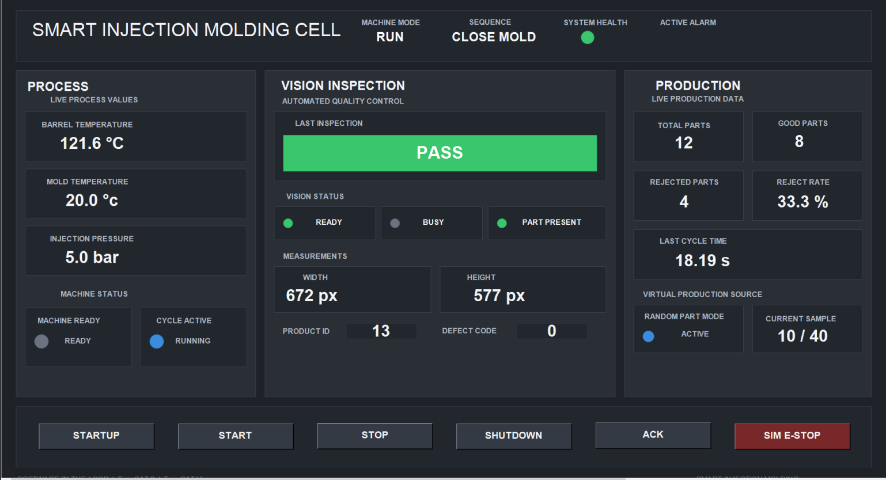
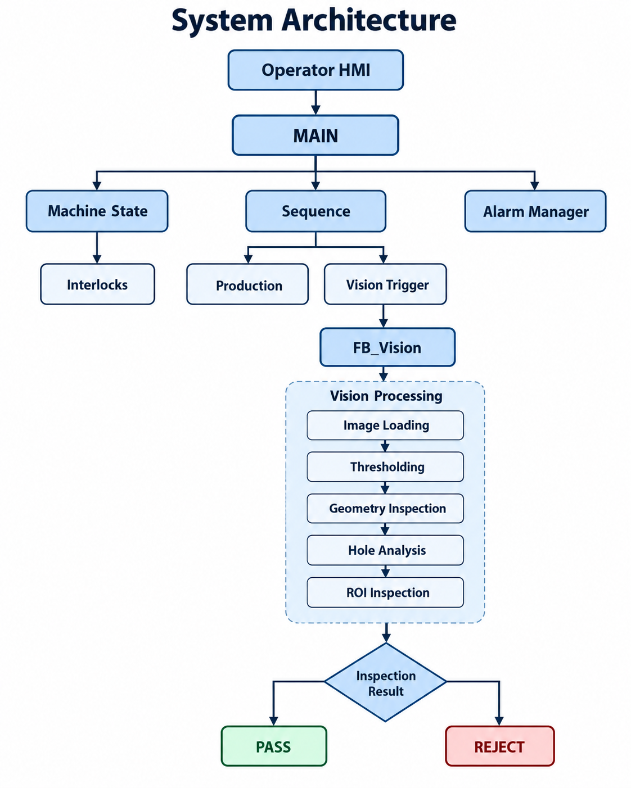
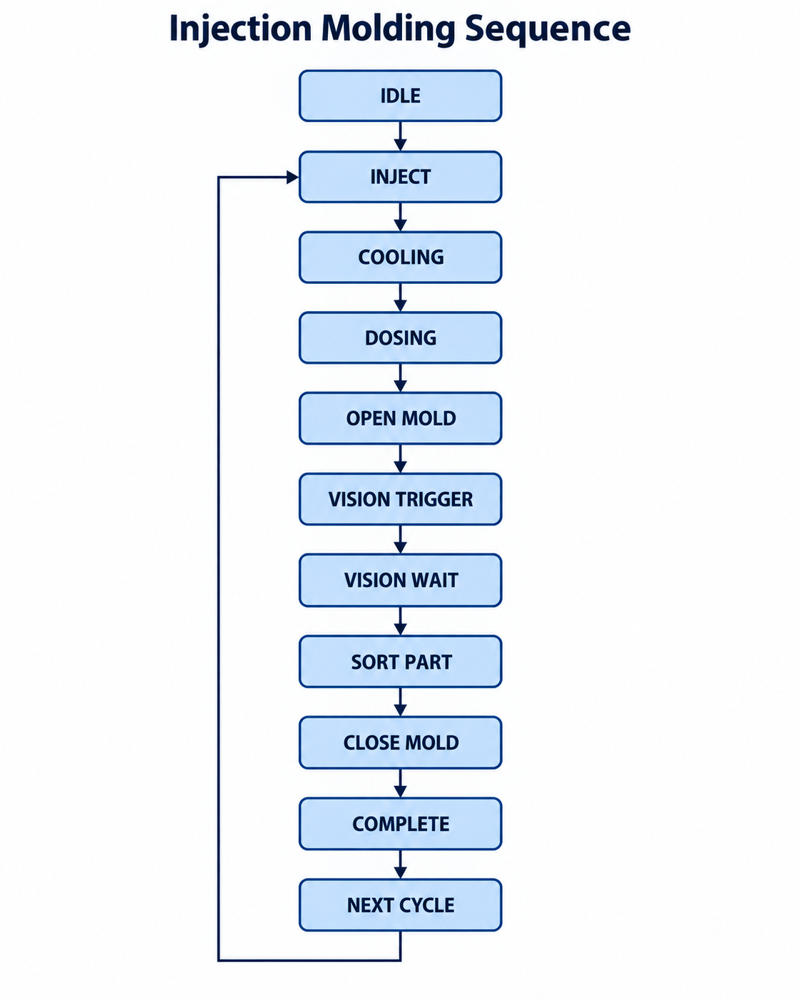
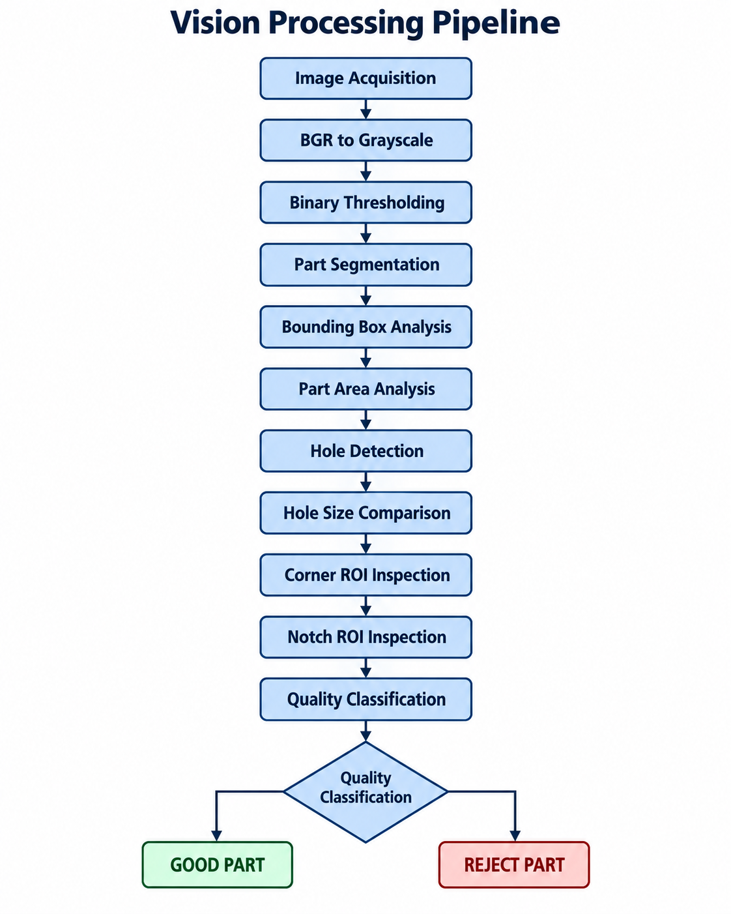
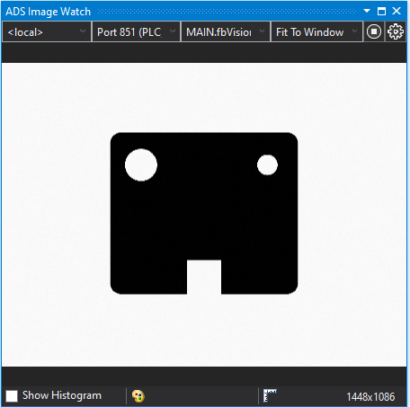
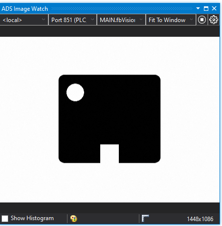
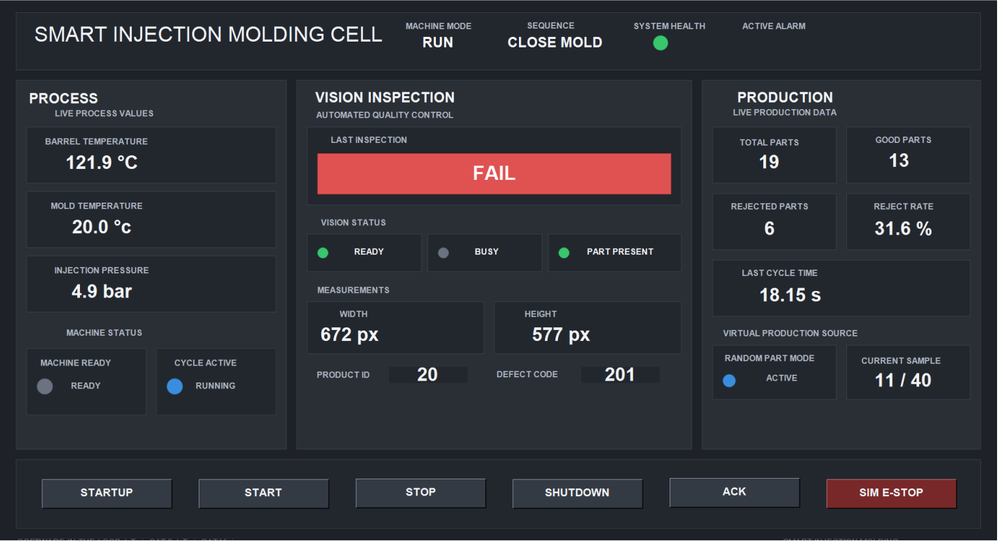
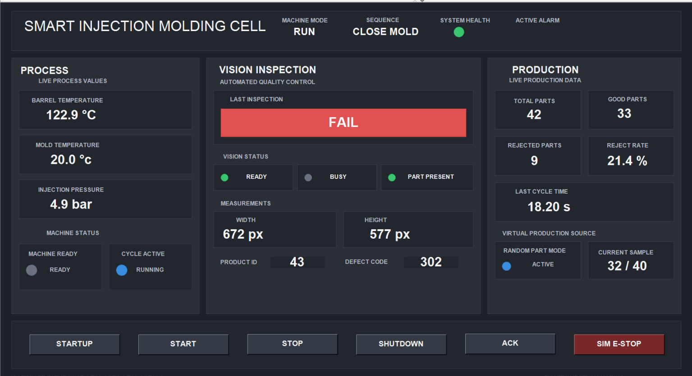
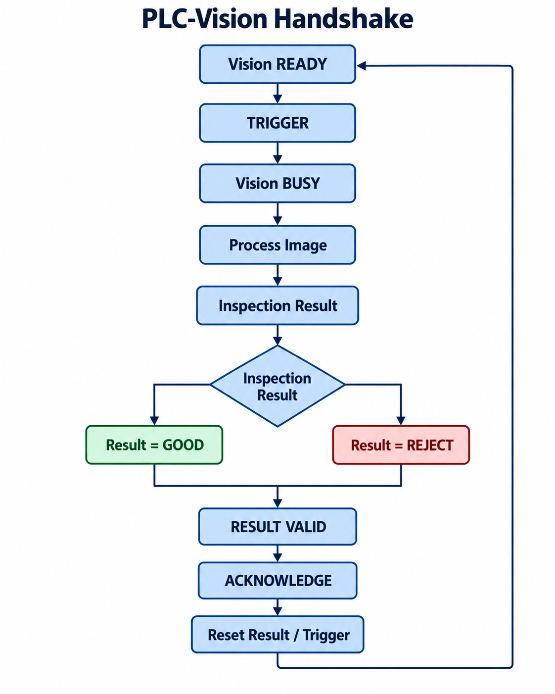
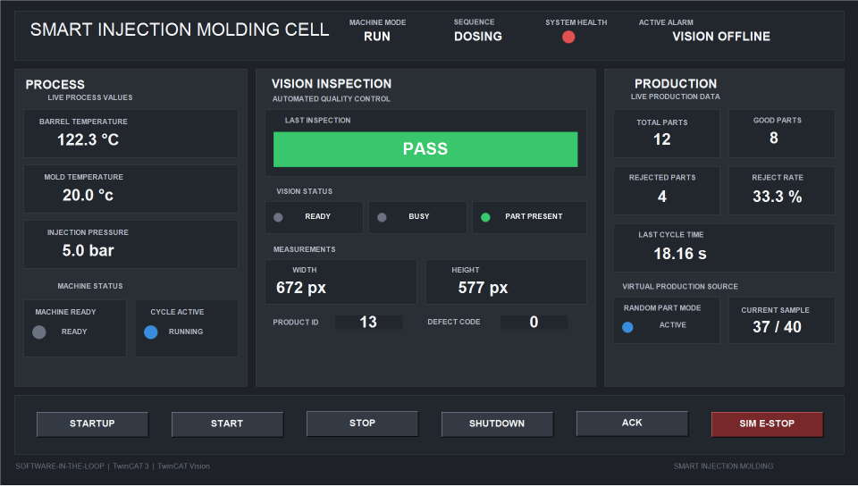

# Smart Injection Molding Cell with TwinCAT Vision

A software-in-the-loop industrial automation project developed in **Beckhoff TwinCAT 3** using **IEC 61131-3 Structured Text**, **TwinCAT Vision**, and **TwinCAT Visualization**.

The project models and controls an injection molding production cell with integrated machine vision inspection, production statistics, alarm handling, interlocks, PID temperature control, randomized part simulation, and operator visualization.

The main goal is to demonstrate how **PLC control, machine sequencing, industrial vision, simulation, diagnostics, and operator interaction** can be combined in a modular automation architecture.

---
## Project Status

| Component | Status |
|---|---|
| PLC Machine Control | ✅ Complete |
| Injection Sequence | ✅ Complete |
| Process Simulation | ✅ Complete |
| PID Temperature Control | ✅ Complete |
| TwinCAT Vision | ✅ Complete |
| Defect Classification | ✅ Complete |
| Randomized Dataset | ✅ Complete |
| Operator HMI | ✅ Complete |
| Alarm Handling | ✅ Complete |
| Physical Camera | 🔜 Future Work |
| SCADA | 🔜 Future Work |

---
## Project Highlights

- Modular IEC 61131-3 Structured Text PLC architecture
- Automatic injection molding state machine
- PID temperature control and process interlocks
- TwinCAT Vision quality inspection
- Geometry, hole, and ROI-based defect detection
- Deterministic PLC-to-vision handshake
- Randomized software-in-the-loop production simulation
- Operator HMI, alarms, cycle time, and production KPIs

---

# Operator HMI

The project includes a custom operator visualization for monitoring the entire production cell.

The HMI provides:

- Machine mode
- Current sequence state
- System health
- Active alarm
- Barrel temperature
- Mold temperature
- Injection pressure
- Machine-ready state
- Cycle-active state
- Vision status
- PASS / FAIL result
- Part width and height
- Product ID
- Defect code
- Total parts
- Good parts
- Rejected parts
- Reject rate
- Last cycle time
- Randomized production mode
- Current virtual sample



The HMI follows a consistent status-color convention:

| Color | Meaning |
|---|---|
| `GREEN` | Ready / healthy / accepted |
| `BLUE` | Active / running |
| `AMBER` | Busy / warning |
| `RED` | Fault / rejected |
| `GREY` | Inactive |

---

# System Architecture



The control architecture separates machine logic, sequence control, vision inspection, alarm management, and operator interaction.

---

## Machine Operating Modes

The machine supports several high-level operating modes.

| Mode       | Description                                    |
| ---------- | ---------------------------------------------- |
| `INITIAL`  | Initial machine state                          |
| `STARTUP`  | Machine preparation and heating                |
| `STOPPED`  | Machine ready but automatic production stopped |
| `RUN`      | Automatic production                           |
| `SHUTDOWN` | Controlled shutdown                            |
| `E-STOP`   | Simulated emergency-stop condition             |

The active machine mode is continuously displayed on the HMI.

---

### Automatic Production Sequence

The injection molding process is implemented as a state machine.



The current sequence state is available both internally in the PLC and on the operator HMI.

## PLC Software Architecture

The PLC application is organized into modular function blocks, separating machine control, simulation, vision inspection, diagnostics, and application coordination.

### Main Control Modules

| Function Block | Responsibility |
|---|---|
| `FB_Machine` | Coordinates the overall machine operation and machine-level control logic |
| `FB_InjectionSequence` | Executes the injection molding production sequence |
| `FB_Interlocks` | Evaluates machine safety and process interlocks |
| `FB_Extruder` | Controls extrusion and dosing-related functions |
| `FB_Mold` | Controls mold opening and closing operations |
| `FB_Hopper` | Handles material level monitoring and hopper filling logic |
| `FB_TemperatureControl` | Performs closed-loop temperature control using PID logic |

### Simulation

| Function Block | Responsibility |
|---|---|
| `FB_PlantSimulation` | Simulates machine sensors, actuators, temperature, pressure, and production behavior |

### Machine Vision

| Function Block | Responsibility |
|---|---|
| `FB_Vision` | Executes image acquisition and the vision inspection pipeline |
| `ST_VisionResult` | Stores inspection measurements and PASS/REJECT results |

### Diagnostics

| Function Block | Responsibility |
|---|---|
| `FB_AlarmManager` | Detects, manages, acknowledges, and resets machine alarms |

### Application Coordination

| Program | Responsibility |
|---|---|
| `MAIN` | Coordinates machine control, production sequence, vision, alarms, and HMI communication |

### Module Hierarchy

```text
MAIN
│
├── FB_Machine
│   ├── FB_InjectionSequence
│   ├── FB_Interlocks
│   ├── FB_Extruder
│   ├── FB_Mold
│   ├── FB_Hopper
│   └── FB_TemperatureControl
│
├── FB_PlantSimulation
│
├── FB_Vision
│   └── ST_VisionResult
│
└── FB_AlarmManager
```

This modular structure separates machine control, simulation, vision processing, and diagnostics, making the application easier to test, maintain, and extend.

## Temperature Control

The project includes a dedicated temperature-control module implemented in `FB_TemperatureControl`.

The function block regulates the barrel temperature using closed-loop PID control and provides the heating and cooling demand required by the simulated injection molding process.

### Responsibilities

| Function | Description |
|---|---|
| Temperature setpoint control | Regulates the barrel temperature around the configured target |
| PID calculation | Calculates the control output based on the temperature error |
| Heating demand | Generates positive control demand when additional heating is required |
| Cooling demand | Generates cooling demand when the measured temperature exceeds the target |
| Process feedback | Uses the simulated barrel temperature as feedback for the controller |

### Configured Operating Point

The current barrel-temperature setpoint is:

```text
120 °C
```
The HMI provides:

- `Barrel Temperature`
- `Mold Temperature`
- `Injection Pressure`

in real time.

## Machine Vision Inspection

The project integrates a dedicated machine-vision inspection module implemented in `FB_Vision` using **TwinCAT Vision**.

The vision subsystem performs automated quality inspection after the mold opens and before the next production cycle begins. The inspection result is returned to the PLC as a structured result and is used to classify each produced component as **PASS** or **REJECT**.

### Responsibilities

| Function | Description |
|---|---|
| Image acquisition | Loads the inspection image from the configured image source |
| Image preprocessing | Converts the source image into grayscale and binary representations |
| Part segmentation | Separates the molded component from the background |
| Geometry inspection | Measures the part dimensions and area |
| Hole inspection | Evaluates hole count and hole size |
| ROI inspection | Checks critical regions such as the corner and notch |
| Result classification | Generates the final PASS/REJECT result and defect code |
| PLC handshake | Coordinates trigger, busy, result-valid, and acknowledgement states |

### Current Image Source

The current implementation uses image files as a **software-in-the-loop virtual image source**.

The image source is selected through:

```text
GVL_Simulation.sVisionImagePath
```
During randomized production, the PLC automatically selects one image from the virtual dataset and passes the selected path to `FB_Vision`.

Example image path:

```text
C:\TcVision\RandomDataset\part_019.png
```
The inspection logic is intentionally separated from the acquisition source so that the file-based input can later be replaced with a physical industrial camera.

### Vision Processing Pipeline
The inspection pipeline is executed inside `FB_Vision`.



### Image Processing Stages

**1. Image Acquisition**

The image is loaded using the TwinCAT Vision image-reading function block.

The selected image path is captured when the inspection is triggered so that the same image is used throughout the complete inspection cycle.


**2. Grayscale Conversion**

The original BGR image is converted to grayscale before thresholding.

This reduces the image to a single intensity channel and simplifies the subsequent segmentation process.
```text
BGR Image
    │
    ▼
Grayscale Image
```


**3. Binary Thresholding**

The grayscale image is converted into binary images using a configured threshold value.

The current threshold is:
```text
Threshold = 128
```
Both normal and inverted threshold representations are used during the inspection.

The inverted binary image is used as the part mask for geometry and connected-component analysis.


**4. Part Geometry Inspection**
The segmented component is evaluated using several geometric characteristics.

The reference part has approximately:
```text
Width:       672 px
Height:      577 px
Part Area:   350970 px
```
The current inspection limits are:
```text
Width:
652 px ... 692 px

Height:
560 px ... 594 px

Part Area:
340441 px ... 361499 px
```
These limits allow the vision system to detect dimensional deviations such as a narrow or incorrectly sized component.

**5. Hole Inspection**

Connected-component analysis is used to identify the holes inside the molded component.

The reference component contains the expected hole structure, and the inspection verifies:

- Hole count
- Relative hole size

The hole-size comparison uses a tolerance of approximately:
```text
10 %
```
This allows the system to identify defects such as:
```text
Missing Hole
Small Hole
```

**6. Corner ROI Inspection**

A dedicated region of interest is used to inspect the corner geometry.

The current ROI is:
```text
X = 970
Y = 245
W = 100
H = 60
```
The reference pixel count is approximately:
```text
4539 pixels
```
with a tolerance of:
```text
±10 %
```
This check is used to detect a chipped or damaged corner.

**7. Notch ROI Inspection**

A second region of interest is used to evaluate the notch geometry.

The current ROI is:
```text
X = 640
Y = 680
W = 170
H = 148
```
The reference pixel count is approximately:
```text
10400 pixels
```
with a tolerance of:
```text
±10 %
```
This check is used to detect an incorrect notch.

### Vision Result Structure

Inspection results are stored in ST_VisionResult.

The structure contains:

| Variable       | Description                                       |
| -------------- | ------------------------------------------------- |
| `bReady`       | Vision subsystem is ready for a new trigger       |
| `bBusy`        | Image processing is currently active              |
| `bResultValid` | A valid inspection result is available            |
| `bPartPresent` | A component was detected in the image             |
| `bPartOK`      | Final PASS/REJECT classification                  |
| `nDefectCode`  | Numeric classification of the detected defect     |
| `fWidth`       | Measured part width                               |
| `fHeight`      | Measured part height                              |
| `fAngle`       | Measured orientation value                        |
| `nProductID`   | Product identifier associated with the inspection |

### Defect Classification

The inspection assigns a numeric defect code to each result.

|  Code | Classification          |
| ----: | ----------------------- |
|   `0` | Good part               |
| `100` | Part not present        |
| `101` | Incorrect width         |
| `102` | Incorrect height        |
| `103` | Incorrect part area     |
| `201` | Incorrect hole count    |
| `202` | Incorrect hole size     |
| `301` | Chipped corner          |
| `302` | Incorrect notch         |
| `401` | Image loading error     |
| `402` | Vision processing error |
| `403` | Vision timeout          |

### Inspection Examples

#### Rejected Parts






### PLC-to-Vision Handshake

The vision subsystem uses a deterministic handshake with the production sequence.



The handshake ensures that:

- each produced component generates one inspection
- the vision system cannot be retriggered while processing
- the PLC waits for a valid result
- the inspection result is acknowledged before the next part begins

### Vision State Machine

The internal vision processing follows a dedicated state machine.
```text
0   IDLE / READY
10  START IMAGE READ
20  WAIT FOR IMAGE
30  PROCESS IMAGE
40  RESULT HOLD
90  TECHNICAL FAULT
```
The result remains available in the result-hold state until the PLC acknowledges it.

### Fault Handling

The vision subsystem includes dedicated fault handling for:
```text
Vision Offline
Vision Timeout
Image Loading Error
Vision Processing Error
```
A vision timeout does not leave the production sequence indefinitely waiting for a result.

The vision fault is reported to the alarm manager and the machine transitions into a controlled state.

### Fault Handling Example

Example validation scenario:

```text
Force Vision Offline
        ↓
Vision subsystem detects communication fault
        ↓
Alarm Manager activates
        ↓
System Health changes to RED
        ↓
Active Alarm displays VISION OFFLINE
```


### Validation

The vision pipeline has been validated using controlled virtual parts representing the following conditions:
```text
Good Reference Part
Narrow Part
Missing Hole
Small Hole
Chipped Corner
Incorrect Notch
```
The corresponding defect classifications were successfully produced during end-to-end machine testing.

The vision subsystem was also tested for:
```text
Vision Offline
Vision Timeout
```
Both scenarios were detected by the alarm logic and resulted in controlled machine behavior.

### Current Limitations

The current inspection setup is designed for a controlled software-in-the-loop environment.

Current limitations include:

- file-based image acquisition
- fixed image position
- absolute ROI coordinates
- measurements expressed in pixels
- no physical camera calibration
- no image registration

## Current Scope

This project is a **software-in-the-loop automation and machine-vision demonstrator**.

The PLC control, process simulation, image processing, production statistics, alarms, and HMI execute in TwinCAT.

Image files emulate triggered camera acquisition. A physical industrial camera and production machine are not currently connected.

### Future Improvements

Planned improvements include:

- GigE Vision / GenICam camera integration
- physical camera triggering
- pixel-to-millimeter calibration
- relative ROI positioning
- image registration
- recipe-specific inspection parameters
- improved robustness to part position and rotation
- AI-based anomaly detection or defect classification